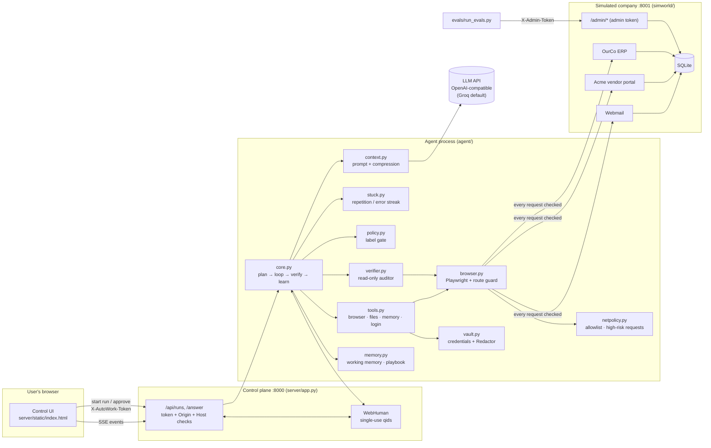
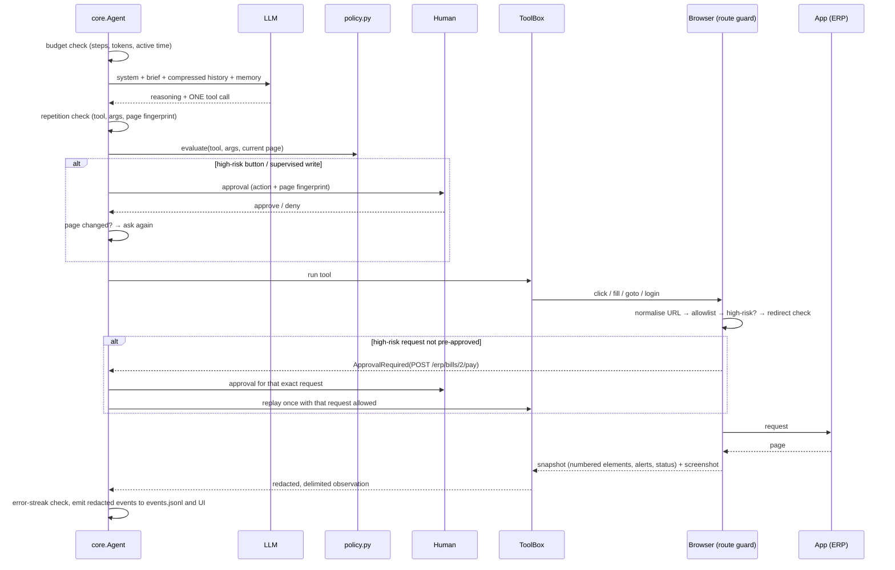

# Architecture

## Components

## One step of the worker loop

## Run lifecycle

1. **Plan.** One JSON call returns the goal, success criteria, a plan and any blocking questions. The blocking questions are asked before any action.
2. **Execute.** The loop above runs until `finish` is called or a budget runs out.
3. **Verify.** If the status is `done`, the auditor (fresh context, same cookies, read-only page) checks each success criterion and returns a verdict. A failed verdict is fed back to the worker, for at most 2 rounds; an inconclusive one yields `unverified`.
4. **Learn.** For verified runs only, a distiller writes up to 5 general notes to `data/playbook.json`. They are injected into future prompts as hints that may be outdated.
5. **Report.** `runs/<id>/report.json` and `events.jsonl` (schema v1, redacted), plus a screenshot per step.

## Data flow and trust boundaries

| Boundary | What crosses it | Trust | Control |
|---|---|---|---|
| Web pages, emails and files → model | Page text, labels, values | **Untrusted** | Wrapped in `<<<UNTRUSTED_…>>>`; secrets redacted; size-limited |
| Model → actions | Tool calls | **Untrusted** | Schema validation; `policy.py`; network guard; approvals; budgets; stuck detection; value-provenance warning after fills (warns, does not block) |
| Agent → apps | HTTP requests | Must stay in scope | Origin allowlist, `/admin` block and high-risk gate on the normalized URL of every request, including redirects |
| Vault → browser | Usernames and passwords | Secret | Filled into the DOM directly; not in prompts; redacted from events, reports and observations (`test_no_secret_in_events_reports_or_prompts`); screenshots are not redacted |
| Agent → LLM provider | Prompts | Leaves the machine | Page and task content; vault secrets are redacted (tested). A secret that appears on a page and is not in the vault would be sent |
| Other local websites → control plane | HTTP | **Untrusted** | Host check, token, Origin check, no CORS |
| Eval harness → `/admin` | Reset, faults, ground truth | Trusted test code | Admin token |
| Worker → verifier | The claim, success criteria and recorded facts | The verifier treats them as claims to check | Fresh context; read-only network layer |

## Why the verifier shares cookies

The auditor opens a new page in the worker's browser *context*, so it is already logged in. That saves login steps and LLM tokens, and avoids a second set of sessions with side effects such as the session-expiry fault. It doesn't weaken the read-only rule, because that rule is enforced per request on the auditor's page, not per session.

## LLM providers: fallback chain and usage log

`agent/llm.py` talks to any OpenAI-compatible API. With `LLM_FALLBACK_MODELS` set, a model that is out of quota (a 429 asking for a wait that would exceed 5 minutes in total) or keeps failing (6 attempts, the last a 5xx, timeout or connection error) is replaced by the next model in the list for the rest of the run; bad keys and unknown models (401/403/404) stop the run instead. Each switch is an `llm_retry` event, and `report.json` records how many calls each model answered (`llm.calls_by_model`). The eval harness disables the chain so results stay per model ([ADR 0007](decisions/0007-provider-fallback-chain.md)).

Each LLM request (successful, or failed with a 429, 400, 5xx, timeout or connection error; not 401/403/404) appends one row to `runs/<id>/llm_usage.jsonl` (`agent/usage.py`): role, step, model, latency, provider-reported token counts, rate-limit headers, a redacted error body, and estimated sizes of each prompt section. No prompt content is stored. `python -m evals.usage_report <run dir>` turns it into per-role totals, peak requests and tokens per minute, the 429s, the largest prompt sections and how the prompt grows by step; it computes daily run capacity only for a complete, single-model run with a known daily limit (reported by the provider, or Groq's free tier of 200k tokens per model).
